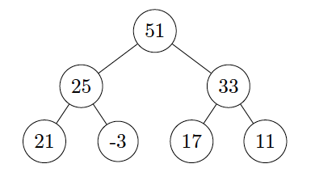

# Dynamic-programming

## Programming Problems
### Problem 1.a. (Max-Heaps) 
Write a C program which takes as input a sequence of n (possibly
negative, not necessarily distinct) integers and constructs a max-heap containing these elements.
Your program will be provided with the value n (the total number of integers in the input) on the
rst line. The next n lines will contain the integers, one integer per line. Your program must output
the level-order traversal of your heap (i.e., the array representation starting at index 1).
The input heap is a perfect binary tree, i.e., n = 2k 􀀀 1.
1
For example if input.txt contains:
```
7
25
21
-3
33
17
11
51
```
One example of a max-heap containing these elements is:
<figure align="center">
  
</figure>

For this heap the output is:
```
$ p1 a < input.txt
51
25
33
21
-3
17
11
```
Note: the solution is not unique, any max-heap will do!
The input may contain duplicate integers, and you must insert all occurrences of each element into
the heap.
For full marks your algorithm for this problem must have a time-complexity of O(n).

### Problem 1.b. (Right-Handed Max-Heaps) 
Create a modied version of your program in Prob-
lem 1.a. which constructs a right-handed max-heap out of the provided input.
A right-handed max-heap is a max-heap which satises the additional property that for each non-leaf
node the right child has a value greater than or equal to the value of the left child.
Your output must be in the same format as in Problem 1.a. and for full marks must have a time
complexity of O(n).
Hint: consider starting from a heap.

### Problem 2.a. (Shortest DAG Paths) 
In this task you will write a dynamic programming solution
which computes the shortest path from node v0 (a source) to node vn􀀀1 (a sink) in a weighted directed
acyclic graph (DAG).
The nodes in the input graph have labels fv0; : : : ; vn􀀀1g. This graph is already topologically ordered,
i.e., if the graph contains an edge (vi; vj) then j is strictly greater than i.
The rst line will contain the number of nodes in the graph n. The n adjacency lists will follow, i.e.,
for each i 2 f0; : : : ; n 􀀀 1g there will be a line giving out-degree(vi), and then out-degree(vi) many
2
lines containing pairs (vj ;wij) which indicate that the DAG contains an edge (vi; vj) with weight wij .
Note that all edge weights wij are positive.
Consider the following graph:
<figure align="center">
  
</figure>

The following input represents this graph:
```
4 // number of nodes
2 // out-degree of v_0
2 7 // indicates that the edge (v_0, v_2) is present with weight 7
1 2
2
2 1
3 7
1
3 3
0
```
Your task is to compute the cost of the shortest path from 0 to n 􀀀 1, and output what that path is.
For this example, the shortest path is v0; v1; v2; v3 with a cost of 6.
Your program must output the cost of the path, and the number of edges in the path, followed by
these vertices (starting with 0 and ending with n 􀀀 1). The output is then:
```
$ p2 a < input.txt
6 // path cost
3 // number of edges in the path
0
1
2
3
```
If there is no path from v0 to vn􀀀1 in the DAG then the only output your program must produce is
"No Path".
It is possible to solve this problem in O(n+m) time (for a DAG with n vertices and m edges), although
any implementation which solves the test cases within the time limit will be accepted.

### Problem 2.b. (Shortest DAG k-Paths) 
Write a program which nds the shortest path which
uses no more than k edges from v0 to vn􀀀1 in an input DAG given in topological order.
The input will be in the same format as for Problem 2.a., except that k is provided on the rst line
as well. So for the example DAG from the previous part, with k = 2 the input will be:
```
4 2 // n and k respectively
2
2 7
1 2
2
2 1
3 7
1
3 3
0
```
Your program must output the solution in the same format as before. For this example the shortest
path using no more than k = 2 edges is v0; v1; v3 which uses 2 edges for a cost of 9. The output is:
```
$ p2 b < input.txt
9 // path cost
2 // number of edges in the path
0
1
3
```
If there does not exist a path from v0 to vn􀀀1 in the DAG using k or fewer edges then the only output
your program must produce is "No Path".
It is possible to solve this problem in O(k(n + m)) time, although any implementation which solves
the test cases within the time limit will be accepted.

### Problem 3. (Binary Search Trees)
Write a C program which does the following:
* Reads in an array of n positive integers.
* Inserts these n integers into a binary search tree, in the order in which they are provided.
* Output the number of nodes in the binary search tree.
* Output the height of the binary search tree (see Denition 3.1.).
* Balance the binary search tree (see Denition 3.2.). Output the elements of this balanced binary search tree.

Note that elements in the binary search tree must be distinct, however the input array may contain
duplicates. For this reason the number of nodes in the tree and the size of the input may not be the
same.
Your program will be provided with n on the first line. The next n lines contain the n integers which
make up the input array.
For example, given the following input:
10 // this is the size of the input array, n
6
8
9
4
4
6
0
3
6
9
The resulting binary search tree is:
<figure align="center">
  
</figure>

The number of nodes in the binary search tree is 6, and the height is 4.
The following is a balanced binary search tree containing these elements:
<figure align="center">
  
</figure>

The first line of your output must be the number of nodes in the tree. The second line must be the
height of the binary search tree (before re-balancing).
You must output the balanced binary search tree in a format similar to how we store a heap, i.e., the
rst line contains the root (index 1) and the node on line i has children at lines 2i and 2i + 1. Note
that your tree might have nodes which do not have a left and/or right child, for these lines in the
output (where the child is null) output -1.
Before printing your balanced binary search tree you must print the number of lines used to represent
the balanced binary search tree. There must not include any trailing -1s.
The output for the example given is:
```
$ p3 < input.txt
6 // the number of nodes
4 // the height of the original binary search tree
7 // the number of lines required to represent the balanced binary search tree
6
3
8
0
4
-1
9
```
Note: implementing a self-balancing tree such as an AVL tree is not required to solve this problem.

## Analysis Problems
### Problem 4. (Average-case complexity of Quicksort) 
In the lectures, we have seen proof for
the average-case complexity of Quicksort (see the lecture capture video for Lecture 14, time stamp
7:35). Your task is to provide proof using a dierent argument, following the logic below.
There are two components in the partition algorithm of Quicksort: 1) select the pivot and 2) partition
the array based on the pivot. Consider an oracle algorithm1 that can, in constant time, choose a pivot
that is guaranteed to lie in between the top 25% and top 75% of the elements in the array.
(a) Prove that using the oracle as a pivot selection strategy would ensure that Quicksort does not
perform worse than O(n  log(n)).
(b) What is the probability that a randomly selected element of the array falls in between the top
25% and top 75%?
(c) Prove that the average case complexity of Quicksort is O(n  log(n)) by combining the reasoning
from the previous two points.
You may nd the following statement helpful in your proof: if a trial's probability of success is
p, then on average it requires n=p trials to achieve n successes.

### Problem 5. (Lexicographical Optimisation with Paths) 
Provide pseudocode and an explanation for an algorithm that computes a path between two nodes in an undirected graph such that:
 The maximum weight in the path is minimised, i.e., there does not exist another path with a
smaller maximum weight.
 Amongst all such paths, it nds the path with minimum cost.
 The time complexity is no worse than O((jEj2 +jEj  jV j)  log(jV j)), where E is the set of edges
and V is the set of nodes. For example, consider computing the optimum path between nodes v0 and v5 for the following graph:
<figure align="center">
  
</figure>

The optimum solution according to the above criteria is the path p = (v0; v2; v3; v5). The path p is
considered more favourable than the path p0 = (v0; v1; v4; v5) as the minimum maximum weight of p
is 2 compared to 3 for p0, even though cost(p) = 6 > 5 = cost(p0).
Your algorithm should take the following input/produce the following output:
```
MinMaxWeightPath Input: An weighted undirected graph G, a start node vs, an end node ve
Output: The path between vs and ve which satises the above conditions,
and the total cost.
```

### Problem 6. (Weighted Graph Reduction) 
Your friend has written an algorithm which solves
the all pairs shortest path problem for unweighted undirected graphs. The cost of a path in this setting
is the number of edges in the path. The algorithm UnweightedAPSP takes the following input and
output:
UnweightedAPSP Input: An unweighted undirected graph G
Output: The costs of the shortest paths between each pair of vertices fu; vg
For example, consider the following graph G.
<figure align="center">
  
</figure>

The output of UnweightedAPSP would be:
```
fA;Bg : 1; fA;Cg : 1; fA;Dg : 1; fB;Cg : 2; fB;Dg : 2; fC;Dg : 2
```
Your task is two use your friend's algorithm UnweightedAPSP to solve the all pairs shortest paths
problem for weighted undirected graphs.
Write an algorithm WeightedAPSP in pseudocode which makes use of the algorithm UnweightedAPSP
to solve the problem. Your algorithm must transform its input into an unweighted graph, call Un-
weightedAPSP, and then interpret the output to correctly compute the costs of the shortest paths
for the original weighted graph. The input and output specication of your algorithm must be:
```
WeightedAPSP Input: A weighted undirected graph G
Output: The costs of the shortest paths between each pair of vertices fu; vg
```
For example, consider the following graph G.
<figure align="center">
  
</figure>

The output of your algorithm UnweightedAPSP must be:
```
fA;Bg : 2; fA;Cg : 4; fA;Dg : 3; fB;Cg : 6; fB;Dg : 5; fC;Dg : 7
```
This type of problem is called a reduction: we have reduced the problem WeightedAPSP to the
problem UnweightedAPSP. Reductions show up frequently in computer science, and is of particular
importance to complexity theory which is concerned with the \hardness" of dierent problems. Usually
we are concerned with what we refer to as a \polynomial-time reduction", which this problem is not.

### Problem 7.a. (Heap Algorithm Analysis) 
In Problem 1.a. you are asked to construct a max-
heap from an input array of n integers in O(n) time.
Write pseudocode for the algorithm you implemented to construct the max-heap. The input/output
specication is:
```
ConstructHeap Input: An array A of n integers
Output: An array H representing a max-heap
```
Prove that your algorithm runs in O(n) time.
The algorithm you discuss must be the same as the algorithm you used in Problem 1.a.

### Problem 7.b. (Right-Handed Heap Algorithm Analysis) 
In Problem 1.b. you are asked to
construct a right-handed max-heap from an input array of n integers in O(n) time.
Write pseudocode for the algorithm you implemented to construct the right-handed max heap. The
input/output specication is:
```
ConstructRightHandedHeap Input: An array A of n integers
Output: An array H representing a right-handed max-heap
```
Prove that your algorithm runs in O(n) time.
The algorithm you discuss must be the same as the algorithm you used in Problem 1.b.

### Problem 8. (Heap Top-k) 
Prof Dubious has made the following claim, and has provided a proof:
Claim. Let n and k be positive integers such that 2k 􀀀1  n. In a max-heap H of n elements, the
top 2k 􀀀 1 elements are in the rst k layers of the heap.
Proof. Since H is a max-heap, each node in H must satisfy the heap property, i.e., if Hi is an
element of H with at least one child then Hi  maxfchildren(Hi)g.
We know that every subtree of the heap H is a heap, as subtrees of complete binary trees are
complete binary trees, and the heap property holds.
8
Therefore since each subtree is a heap, the maximum element in each subtree must be at the root
of that subtree.
Clearly, the largest element in H is at the root. Since the left and right subtrees are also heaps the
next two largest elements must be at the root of each of these subtrees, i.e., the left and right child
of the root.
Hence, the largest 22 􀀀 1 = 3 elements of the heap lie in the rst 2 layers. We repeatedly apply
this argument to each subtree until we have considered the rst k layers. Thus the largest 2k 􀀀 1
elements in the heap must be in the rst k layers. 
Brie
y describe what is wrong with Professor Dubious's argument and provide a counter-example to
their claim.